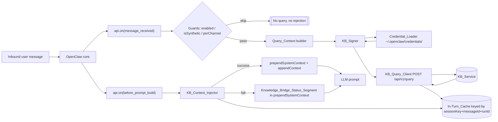
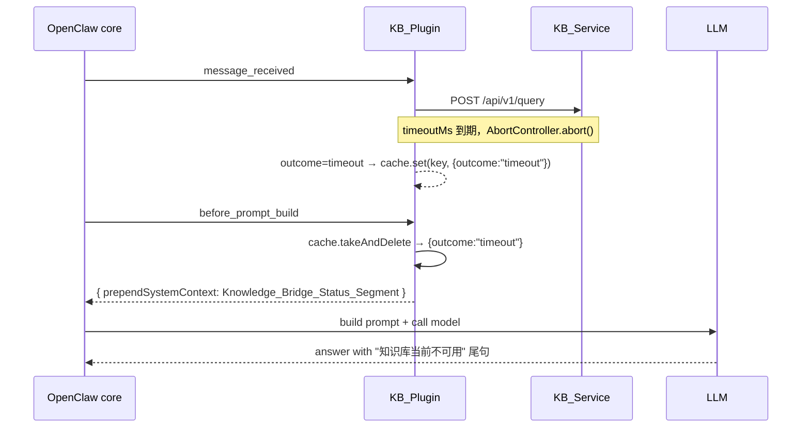
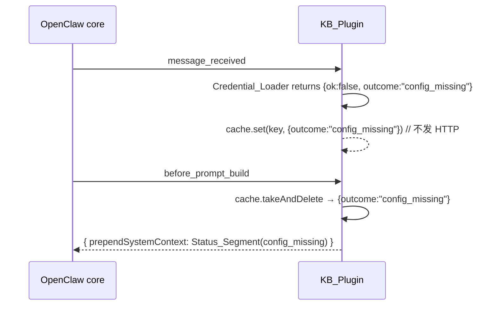

# Design Document

## 1. 概览 (Overview)

Knowledge Bridge Plugin（简称 KB_Plugin）是 OpenClaw 的一个旁路式知识注入插件。它只做两件事：
在 `message_received` hook 里拉取一次 KB_Service 的 `/api/v1/query`，把返回的 Evidence_Bundle
暂存到 turn 级缓存；然后在 `before_prompt_build` hook 里把证据和约束句注入当前 agent turn 的
system/上下文。任一环节失败都走"放行原始对话 + 注入 Knowledge_Bridge_Status_Segment"的降级路径，
不中断 agent turn、不重试。（对应 Requirement 1 / 2 / 4 / 5 / 6）



本文档与 requirements 1:1 对齐。每条实现决策在末尾标注对应 Requirement ID。

## 2. 包布局与交付 (Package Layout)

### 2.1 目录结构

插件根目录 `extensions/knowledge-bridge/`。源码布局参照 `extensions/memory-wiki/`
（`index.ts` 入口 + `src/**` 内部 + `api.ts` 对外 barrel）：

```
extensions/knowledge-bridge/
  openclaw.plugin.json           # 插件 manifest（id、hooks、configSchema）
  package.json                   # name=@openclaw/knowledge-bridge，本地声明运行时依赖
  tsconfig.json                  # extends ../tsconfig.package-boundary.base.json
  api.ts                         # 对 core/测试友好的极简 barrel（导出 definePluginEntry、类型）
  index.ts                       # definePluginEntry 入口，仅注册两条 hook
  README.md                      # 配置 / 凭据 / 降级说明
  src/
    config.ts                    # KB_Config 类型 + typebox schema + resolveKbConfig
    context.ts                   # Query_Context 派生 + isSynthetic / perChannel 判定
    credentials.ts               # Credential_Loader（~/.openclaw/credentials 读取 + 脱敏）
    signer.ts                    # KB_Signer（sha256 + HMAC + base64 纯函数）
    evidence-schema.ts           # Evidence_Bundle 的 typebox schema
    query-client.ts              # POST /api/v1/query + AbortController + schema 校验
    turn-cache.ts                # In-Turn_Cache（Map + TTL 兜底）
    injector.ts                  # KB_Context_Injector（成功模板 + 降级模板）
    telemetry.ts                 # 结构化事件 + summarize / hash helpers
    dispatcher.ts                # 编排：message_received → query → cache；before_prompt_build → injector
    __tests__/                   # 单元与 property 风格 vitest 文件
      signer.test.ts
      credentials.test.ts
      evidence-schema.test.ts
      query-client.test.ts
      injector.test.ts
      context.test.ts
      turn-cache.test.ts
      telemetry.test.ts
  index.test.ts                  # dispatcher + hook 集成断言（参照 active-memory/index.test.ts）
```

该布局遵守 extensions/AGENTS.md：生产代码只 import `openclaw/plugin-sdk/*`、本包相对路径、
本包 `package.json` 声明的运行时依赖。不深入 core `src/**`、`src/plugin-sdk-internal/**`、
其他 extension `src/**`。（对应 Requirement 10.1 / 10.2）

### 2.2 运行时依赖

选型：runtime 依赖只用 `typebox`（与 memory-wiki 对齐；避免再引入 `zod` 作为新的根/插件依赖），
其余全部落在 Node 22+ 内置能力（`node:crypto`、`node:fs`、`node:path`、`node:os`、全局 `fetch` +
`AbortController`）与 `openclaw/plugin-sdk/*`。`package.json` 形态：

```jsonc
{
  "name": "@openclaw/knowledge-bridge",
  "version": "2026.5.4",
  "private": true,
  "type": "module",
  "dependencies": {
    "typebox": "1.1.37",
  },
  "devDependencies": {
    "@openclaw/plugin-sdk": "workspace:*",
    "openclaw": "workspace:*",
  },
  "peerDependencies": {
    "openclaw": ">=2026.5.4",
  },
  "peerDependenciesMeta": {
    "openclaw": { "optional": true },
  },
  "openclaw": {
    "extensions": ["./index.ts"],
  },
}
```

不向仓库根 `package.json` 新增依赖；`pnpm deps:root-ownership:check` 必须保持绿。
（对应 Requirement 10.3）

### 2.3 交付与质量门

- `pnpm check:changed` 覆盖 extension prod + extension test 两条 lane。
- `pnpm plugin-sdk:api:check` 保持绿。
- V1 不要求 live Testbox；`extensions/knowledge-bridge/` 不产出 live test。
  （对应 Requirement 10.4）

## 3. 配置契约 (Configuration Contract)

### 3.1 TypeScript 类型

```ts
export type KBSharedSecretRef = {
  /** ~/.openclaw/credentials 下的相对 key（可以包含 "/"）*/
  credentialKey: string;
};

export type KBConfig = {
  enabled: boolean; // default true
  baseUrl: string; // default "http://127.0.0.1:8111"
  sharedSecretRef: KBSharedSecretRef;
  timeoutMs: number; // default 3000, 250..120000
  strictKbOnlyDefault: boolean; // default false
  needCitationDefault: boolean; // default false
  perChannel: Record<string, boolean>; // default {}
};
```

### 3.2 manifest JSON Schema（`openclaw.plugin.json` 片段）

```jsonc
{
  "id": "knowledge-bridge",
  "name": "Knowledge Bridge",
  "description": "Queries the local Knowledge Bridge service and injects evidence into the next LLM turn.",
  "activation": { "onStartup": true },
  "configSchema": {
    "type": "object",
    "additionalProperties": false,
    "properties": {
      "enabled": { "type": "boolean" },
      "baseUrl": { "type": "string", "format": "uri" },
      "sharedSecretRef": {
        "type": "object",
        "additionalProperties": false,
        "required": ["credentialKey"],
        "properties": {
          "credentialKey": { "type": "string", "minLength": 1 },
        },
      },
      "timeoutMs": { "type": "integer", "minimum": 250, "maximum": 120000 },
      "strictKbOnlyDefault": { "type": "boolean" },
      "needCitationDefault": { "type": "boolean" },
      "perChannel": {
        "type": "object",
        "additionalProperties": { "type": "boolean" },
      },
    },
  },
}
```

运行时由 `src/config.ts` 的 typebox schema 再次校验 `api.pluginConfig`，生成带默认值的
`KBConfig` 纯对象。（对应 Requirement 7.1 / 7.3）

### 3.3 校验失败行为

- 任意字段类型错误、`baseUrl` 非 URL、`timeoutMs` 越界、`sharedSecretRef.credentialKey` 空：
  记录一次结构化启动错误（`KB_QUERY_EVENT { Query_Outcome: "disabled" }`），此后插件全程进入
  "等同 enabled=false"分支；不发起任何 KB_Service 请求、不注入任何片段。（对应 Requirement 1.5 / 7.2）
- 未提供的字段按 3.1 的默认值填充；字段以外的额外键被 `additionalProperties: false` 拒绝。

### 3.4 热更新规则

- `baseUrl`、`timeoutMs`、`strictKbOnlyDefault`、`needCitationDefault`、`perChannel`、`enabled`
  均通过 `api.pluginConfig` 在每次 `message_received` 进入时解析一次即可热生效。
- `sharedSecretRef.credentialKey` 的取值变化在下一次 signature 前被 Credential_Loader 观察到
  （见 §4 的缓存策略）；底层凭据文件内容变化通过 mtime 检测热生效。
- 整体遵循 OpenClaw"config 变更对下一次 `message_received` 生效"语义，不重启 Gateway。
  （对应 Requirement 7.4 / 7.5）

## 4. 凭据加载 (Credential Loader)

### 4.1 路径解析与安全

来自 `openclaw/plugin-sdk/secret-file-runtime`：

```ts
import { loadSecretFileSync } from "openclaw/plugin-sdk/secret-file-runtime";
import os from "node:os";
import path from "node:path";
```

解析：

```ts
function resolveCredentialPath(credentialKey: string): string {
  const normalized = credentialKey.replace(/^[/\\]+/, ""); // 禁绝对路径
  const root = path.join(os.homedir(), ".openclaw", "credentials");
  const candidate = path.resolve(root, normalized);
  const rel = path.relative(root, candidate);
  if (rel.startsWith("..") || path.isAbsolute(rel)) {
    throw new Error("credentialKey must stay under ~/.openclaw/credentials");
  }
  return candidate;
}
```

依赖 SDK `loadSecretFileSync` 自身的 symlink / 大小 / 文件类型校验。
（对应 Requirement 3.6，AGENTS.md "channel/provider creds in `~/.openclaw/credentials/`"）

### 4.2 读取流程（伪代码）

```ts
type CredentialLoad =
  | { ok: true; secret: Buffer; resolvedPath: string; mtimeMs: number }
  | { ok: false; outcome: "config_missing" };

export function loadKbSharedSecret(
  ref: KBSharedSecretRef,
  opts: { now: () => number; logger: PluginLogger },
): CredentialLoad {
  const resolved = tryResolve(ref.credentialKey);
  if (!resolved) return { ok: false, outcome: "config_missing" };
  const stat = tryLstatSync(resolved);
  if (!stat) return { ok: false, outcome: "config_missing" };
  const result = loadSecretFileSync(resolved, "knowledge-bridge shared secret", {
    rejectSymlink: true,
  });
  if (!result.ok) {
    logger.warn("kb.credential.load_failed", { reason: "io_or_empty_or_validation" }); // 不记录消息原文
    return { ok: false, outcome: "config_missing" };
  }
  return {
    ok: true,
    secret: Buffer.from(result.secret, "utf8"),
    resolvedPath: result.resolvedPath,
    mtimeMs: stat.mtimeMs,
  };
}
```

失败分类一律归到 `Query_Outcome = config_missing`：文件不存在、大小为 0、I/O 错误、symlink
拒绝、路径越界。启动时记录一次（由 `index.ts` 的 register 阶段主动 probe 触发，但不中断启动）；
首次请求 `/query` 前再记录一次，之后按事件节流（同一 credentialKey 的重复失败降级为 debug 级）。
（对应 Requirement 3.7 / 6.5）

### 4.3 缓存与刷新策略

进程级缓存 `Map<credentialKey, { secret: Buffer; mtimeMs: number; resolvedPath: string }>`。
每次签名前执行：

```ts
const stat = tryLstatSync(cached.resolvedPath);
if (!stat || stat.mtimeMs !== cached.mtimeMs) {
  return reload(credentialKey);
}
return cached;
```

这样既避免每次请求都走磁盘，又保证 Credential_Store 轮换后下一次 `/query` 生效。
（对应 Requirement 7.5，且与 OpenClaw 标准凭据刷新语义一致）

### 4.4 内存与日志红线

- `secret: Buffer` 只在 `signRequest()` 内部被 `createHmac("sha256", secret)` 消耗；不落 console.log、
  不落 telemetry、不放进 `api.pluginConfig`、不进 `QueryResult`。
- `telemetry.ts` 对 logger/event 输入一律过白名单字段；见 §10.3。
- 插件首次加载时通过 SDK provided `PluginLogger` 发一条 "credential store resolved"（只含
  `resolvedPath` 路径字符串，不含字节长度、不含任何内容）。
  （对应 Requirement 3.8 / 6.11 / 8.2）

## 5. 签名实现 (KB_Signer)

### 5.1 纯函数接口

```ts
// src/signer.ts
import { createHash, createHmac, randomUUID } from "node:crypto";

export type SignedHeaders = {
  "X-KB-RequestId": string;
  "X-KB-Timestamp": string;
  "X-KB-Signature": string;
  "Content-Type": "application/json";
};

export function computeBodyHashHex(body: Uint8Array): string {
  return createHash("sha256").update(body).digest("hex"); // lowercase hex
}

export function signRequest(params: {
  body: Uint8Array;
  requestId: string; // UUID v4（调用方决定来源，便于 PBT 固定随机）
  timestampMs: number;
  secret: Buffer | string;
}): SignedHeaders {
  const bodyHash = computeBodyHashHex(params.body);
  const signatureContent = `${params.requestId}${params.timestampMs}${bodyHash}`;
  const signature = createHmac("sha256", params.secret)
    .update(signatureContent, "utf8")
    .digest("base64");
  return {
    "X-KB-RequestId": params.requestId,
    "X-KB-Timestamp": String(params.timestampMs),
    "X-KB-Signature": signature,
    "Content-Type": "application/json",
  };
}

export function newRequestId(): string {
  return randomUUID(); // UUID v4
}
```

### 5.2 调用约定

- `body` 为最终发给 `fetch` 的字节（`new TextEncoder().encode(JSON.stringify(payload))`），
  `JSON.stringify` 的 key 顺序由 payload 构造侧决定（`{ requestId, userId, chatId?, sessionKey?,
messageId?, question, channelType?, isGroup, flags }`）。
- `payload.requestId` 必须与 `X-KB-RequestId` 同值。
- `timestampMs = Date.now()`，在同一次 request 内只读取一次，和 header、`signatureContent` 共用。
- 单次 request 内 `createHmac` 只调用一次；错误（例如 `secret` 为空 Buffer）由调用方在 §4 已提前
  归类到 `config_missing`，不会进入 signer。
- 若 `createHmac.update` / `digest` 抛错（Node 内置极少见），由 `query-client.ts` 捕获并标记
  `Query_Outcome = signature_error`。

（对应 Requirement 3.1 / 3.2 / 3.3 / 3.4 / 3.5 / 6.6 / 9.1 / 9.2 / 9.3）

### 5.3 Header 与 body 协同

请求构造的顺序是固定的：

1. 生成 `requestId`、`timestampMs`；
2. 构造 `payload`（key 顺序固定，见 §6.2）；
3. `body = TextEncoder.encode(JSON.stringify(payload))`；
4. `headers = signRequest({ body, requestId, timestampMs, secret })`；
5. `fetch(url, { method: "POST", headers, body })`。

这条顺序是"确定性注入"之外的第二个字节稳定点（对 prompt cache 没有影响，但对 KB_Service 的
时间戳容差 5min / 重放检测有意义）。

## 6. `/query` 调用 (KB_Query_Client)

### 6.1 Evidence_Bundle schema（typebox）

```ts
// src/evidence-schema.ts
import { Type, Static } from "typebox";

const Route = Type.Union([
  Type.Literal("KB_ONLY"),
  Type.Literal("KB_PLUS_LLM"),
  Type.Literal("LLM_ONLY"),
]);

const Confidence = Type.Union([Type.Literal("HIGH"), Type.Literal("MEDIUM"), Type.Literal("LOW")]);

export const EvidenceSource = Type.Object({
  dataset: Type.String(),
  title: Type.String(),
  content: Type.String(),
  score: Type.Number(),
  metadata: Type.Optional(Type.Record(Type.String(), Type.Unknown())),
});

export const EvidenceBundle = Type.Object({
  requestId: Type.String({ minLength: 1 }),
  route: Route,
  allowModelSupplement: Type.Boolean(),
  sources: Type.Array(EvidenceSource),
  instructions: Type.Array(Type.String()),
  retrievalQuality: Type.Object({
    hitCount: Type.Integer({ minimum: 0 }),
    confidence: Confidence,
    truncated: Type.Boolean(),
    originalHitCount: Type.Integer({ minimum: 0 }),
  }),
});

export type EvidenceBundle = Static<typeof EvidenceBundle>;
```

### 6.2 请求构造

```ts
type QueryPayload = {
  requestId: string;
  userId: string;
  chatId?: string;
  sessionKey?: string;
  messageId?: string;
  question: string;
  channelType?: string;
  isGroup: boolean;
  flags: {
    strictKbOnly: boolean;
    needCitation: boolean;
  };
};
```

key 顺序显式固定（避免 `JSON.stringify` 实现差异带来的字节漂移）。`flags` 取自 `KBConfig`
的 `strictKbOnlyDefault` / `needCitationDefault`。`question` 直接使用 `Query_Context.question`
原文（不截断，发送到本地 HTTP）。（对应 Requirement 4.1 / 7.1）

### 6.3 调用与失败分类

```ts
// src/query-client.ts
export type QueryOutcome =
  | "success"
  | "timeout"
  | "http_error"
  | "schema_error"
  | "signature_error"
  | "config_missing"
  | "disabled";

export type QueryResult =
  | { outcome: "success"; bundle: EvidenceBundle }
  | { outcome: Exclude<QueryOutcome, "success">; httpStatus?: number };

export async function executeKbQuery(args: {
  baseUrl: string;
  timeoutMs: number;
  payload: QueryPayload;
  secret: Buffer;
  now: () => number;
}): Promise<QueryResult & { durationMs: number; requestId: string }> {
  const body = new TextEncoder().encode(stableStringify(args.payload));
  let headers: SignedHeaders;
  try {
    headers = signRequest({
      body,
      requestId: args.payload.requestId,
      timestampMs: args.now(),
      secret: args.secret,
    });
  } catch {
    return { outcome: "signature_error", durationMs: 0, requestId: args.payload.requestId };
  }
  const ctrl = new AbortController();
  const timer = setTimeout(() => ctrl.abort(), args.timeoutMs);
  const started = args.now();
  try {
    const res = await fetch(`${args.baseUrl}/api/v1/query`, {
      method: "POST",
      headers,
      body,
      signal: ctrl.signal,
    });
    const durationMs = args.now() - started;
    if (!res.ok) {
      return {
        outcome: "http_error",
        httpStatus: res.status,
        durationMs,
        requestId: args.payload.requestId,
      };
    }
    let parsed: unknown;
    try {
      parsed = await res.json();
    } catch {
      return { outcome: "schema_error", durationMs, requestId: args.payload.requestId };
    }
    if (!validateEvidenceBundle(parsed)) {
      return { outcome: "schema_error", durationMs, requestId: args.payload.requestId };
    }
    return {
      outcome: "success",
      bundle: parsed as EvidenceBundle,
      durationMs,
      requestId: args.payload.requestId,
    };
  } catch (err) {
    clearTimeout(timer);
    if (isAbortError(err)) {
      return {
        outcome: "timeout",
        durationMs: args.now() - started,
        requestId: args.payload.requestId,
      };
    }
    return {
      outcome: "http_error",
      durationMs: args.now() - started,
      requestId: args.payload.requestId,
    };
  } finally {
    clearTimeout(timer);
  }
}
```

失败分类映射：

| 失败源                                                     | QueryOutcome                             |
| ---------------------------------------------------------- | ---------------------------------------- |
| `AbortError`（timeout 到期）                               | `timeout`                                |
| 网络 / DNS / TLS / ECONN / fetch 抛错                      | `http_error`                             |
| HTTP status 非 2xx                                         | `http_error`（保留 httpStatus 用于日志） |
| `await res.json()` 抛错                                    | `schema_error`                           |
| typebox `validateEvidenceBundle` 失败（含 route 枚举越界） | `schema_error`                           |
| Credential_Loader 归类 `config_missing`                    | `config_missing`（不进入本函数）         |
| `signRequest` 抛错                                         | `signature_error`                        |

所有失败分支都 **不重试**、**不阻塞 turn**。（对应 Requirement 3.7 / 4.2 / 4.3 / 4.4 / 6.1–6.6）

### 6.4 `sources[]` 的稳定顺序

`validateEvidenceBundle` 成功后保留响应原始顺序。Requirement 4.6 要求按 `score` 降序保留；
Service 契约（`api_openclaw.txt`）已声明 "按 score 降序"，本插件不做二次排序，但在注入前
（§8.2）会用稳定排序 `[...sources].sort((a, b) => b.score - a.score)` 兜底，以防上游实现小漂移。
（对应 Requirement 4.6）

### 6.5 In-Turn_Cache（turn-cache.ts）

Key 构造：`"<sessionKey|""> + "|" + <messageId|""> + "|" + <runId|"">`。Value：`QueryResult`。
存储策略：

- `dispatcher.ts` 在 `message_received` 完成 `/query` 后立即写入。
- `dispatcher.ts` 在 `before_prompt_build` 读出后立即 `delete`（每 turn 只注入一次）。
- 硬 TTL = 120s（`setTimeout` 自动过期，防止异常长 turn 泄漏条目）。
- 同一条目被 TTL 淘汰时触发 `KB_INJECTION_EVENT { injected: false, reason: "cache_expired" }`。

（对应 Requirement 4.5）

## 7. 触发与 Query_Context 派生 (Dispatcher on `message_received`)

### 7.1 hook 注册

```ts
// index.ts
api.on("message_received", (event, ctx) => dispatchMessageReceived(event, ctx, services), {
  priority: 50,
  timeoutMs: resolveHookTimeoutMs(services.config.timeoutMs) + 500,
});

api.on("before_prompt_build", (event, ctx) => dispatchBeforePromptBuild(event, ctx, services), {
  timeoutMs: 2_000,
});
```

`message_received` 的默认 `timeoutMs = KBConfig.timeoutMs + 500`（给 AbortController 先自取消
一点 headroom，再由 hook runner 兜底）。`before_prompt_build` 是纯内存操作，用 2s 即可。
操作员可通过 `plugins.entries["knowledge-bridge"].hooks.timeouts.<hook>` 覆盖（SDK 已保证 ≤ 600000
且优先于 `api.on` 的 `timeoutMs`，详见 `docs/plugins/hooks.md`）。（对应 Requirement 5.9 / 6.10）

### 7.2 guard 顺序

```ts
async function dispatchMessageReceived(event, ctx, services) {
  const cfg = resolveKbConfig(services.api.pluginConfig);
  if (!cfg.enabled) return; // Requirement 1.5
  if (ctx.isSynthetic === true) return; // Requirement 2.9
  if (isNonTextInbound(event)) return; // V1：非文本直接 skip（见 §16 风险 3）
  const channelType = ctx.messageProvider;
  if (channelType && cfg.perChannel[channelType] === false) return; // Requirement 2.10
  const queryCtx = buildQueryContext(event, ctx);
  // ... 继续 signing / fetch
}
```

### 7.3 Query_Context 派生

```ts
function buildQueryContext(event, ctx): QueryPayload {
  const userId = ctx.senderId ?? anonymousFromSession(ctx.sessionKey);
  return {
    requestId: newRequestId(),
    userId,
    chatId: ctx.threadId, // Requirement 2.3
    sessionKey: ctx.sessionKey, // Requirement 2.4
    messageId: ctx.messageId, // Requirement 2.5
    question: extractTextContent(event), // Requirement 2.8
    channelType: ctx.messageProvider, // Requirement 2.6
    isGroup: deriveIsGroup(ctx), // Requirement 2.7
    flags: {
      strictKbOnly: services.config.strictKbOnlyDefault,
      needCitation: services.config.needCitationDefault,
    },
  };
}

function anonymousFromSession(sessionKey?: string): string {
  if (!sessionKey) return "anon-unknown";
  return "anon-" + createHash("sha256").update(sessionKey).digest("hex").slice(0, 16);
}

function deriveIsGroup(ctx): boolean {
  // V1: 仅基于 threadId 存在 + channelMetadata.isGroup（若 SDK 提供）
  return Boolean(ctx.threadId) || Boolean(ctx.channelMetadata?.isGroup);
}

function extractTextContent(event): string {
  // event.content 或 SDK 暴露的等价字段
  return typeof event.content === "string" ? event.content : "";
}
```

`isSynthetic` / `channelMetadata.isGroup` **待验证**（见 §16 风险 1）。
（对应 Requirement 2.1–2.10）

### 7.4 query 执行与缓存写入

```ts
const secret = services.credentials.get(cfg.sharedSecretRef);
if (!secret.ok) {
  services.telemetry.emitQuery({
    outcome: "config_missing",
    requestId: queryCtx.requestId,
    ctx,
    queryCtx,
  });
  services.cache.set(cacheKey(ctx), { outcome: "config_missing" });
  return;
}
const result = await executeKbQuery({
  baseUrl: cfg.baseUrl,
  timeoutMs: cfg.timeoutMs,
  payload: queryCtx,
  secret: secret.secret,
  now: Date.now,
});
services.telemetry.emitQuery({ ...result, ctx, queryCtx });
services.cache.set(cacheKey(ctx), result);
```

`cacheKey(ctx) = "${ctx.sessionKey ?? ""}|${ctx.messageId ?? ""}|${ctx.runId ?? ""}"`。
（对应 Requirement 4.5 / 6.1–6.6 / 8.1）

## 8. 注入器 (KB_Context_Injector on `before_prompt_build`)

### 8.1 生命周期

```ts
function dispatchBeforePromptBuild(event, ctx, services) {
  const cfg = resolveKbConfig(services.api.pluginConfig);
  if (!cfg.enabled) return undefined;
  const key = cacheKey(ctx);
  const cached = services.cache.takeAndDelete(key);
  if (!cached) return undefined;                              // Requirement 5.7：不做跨 turn 影响
  const injectionBlocked = ctx.hooks?.allowPromptInjection === false;
  if (injectionBlocked) {
    services.telemetry.emitInjection({ outcome: cached.outcome, requestId: ..., injected: false });
    return undefined;                                         // Requirement 5.9 / 6.10
  }
  const out = cached.outcome === "success"
    ? renderSuccess(cached.bundle, cfg)
    : renderStatusSegment(cached.outcome);
  services.telemetry.emitInjection({ outcome: cached.outcome, requestId: ..., injected: true });
  return out;
}
```

### 8.2 成功路径模板

返回结构：

```ts
return {
  prependSystemContext: buildSuccessSystem(bundle),
  appendContext: buildKnowledgeSources(bundle),
};
```

`buildSuccessSystem(bundle)` 字面模板（中文；`{…}` 为插值槽，插值为字面量拼接，不做格式化函数）：

```
Knowledge_Bridge 已为本轮注入知识上下文。

Route: {bundleRouteLabel}
  - KB_ONLY      → 仅依据下方 Knowledge_Sources 回答
  - KB_PLUS_LLM  → 优先依据 Knowledge_Sources，可补充但需标注
  - LLM_ONLY     → 本轮未命中知识库，请依据模型自身知识回答

Instructions:
{bulletedInstructions}

Retrieval_Quality:
  hitCount={retrievalQuality.hitCount}
  confidence={retrievalQuality.confidence}
  truncated={retrievalQuality.truncated}
{lowConfidenceMarker}

Answer_Boundary:
{boundaryClause}
```

插值规则：

- `bundleRouteLabel` ∈ `{"KB_ONLY", "KB_PLUS_LLM", "LLM_ONLY"}`（字面原样，Latin，不翻译）。
- `bulletedInstructions`：按输入顺序 `instructions[].map(x => "  - " + x).join("\n")`；空数组时
  渲染为 `  (无额外指令)`。
- `lowConfidenceMarker`：当 `retrievalQuality.confidence === "LOW"` OR `retrievalQuality.hitCount === 0`
  时输出 `  retrievalConfidence=LOW`；否则输出空字符串（不换行）。（对应 Requirement 5.6）
- `boundaryClause` 按下表确定性选择（**Requirement 5.4 / 5.5 / 9.5 / 9.6**）：

| 条件                                                          | 字面输出                                                                                                             |
| ------------------------------------------------------------- | -------------------------------------------------------------------------------------------------------------------- |
| `route === "KB_ONLY"` OR `allowModelSupplement === false`     | `仅依据提供的 Knowledge_Sources 回答；若证据不足，回答"知识库未收录该问题"。不得补充 Knowledge_Sources 以外的事实。` |
| `route === "KB_PLUS_LLM"` AND `allowModelSupplement === true` | `优先依据 Knowledge_Sources；若需补充模型自身知识，必须显式标注"基于模型自身知识"。`                                 |
| `route === "LLM_ONLY"` AND `sources.length === 0`             | `本轮无 Knowledge_Sources，按 LLM 自身知识回答；若涉及本地知识库相关话题，可说明"知识库未收录"。`                    |
| 其他                                                          | `优先依据 Knowledge_Sources；不得编造未在 Knowledge_Sources 中出现的事实。`                                          |

`buildKnowledgeSources(bundle)` 渲染为 `appendContext`（用户上下文，而非 system）：

```
# Knowledge_Sources
{blocksJoinedWithSeparator}
```

其中每个 source block：

```
## [{dataset}] {title}  (score={score.toFixed(4)})
{content}
```

blocks 排序：`[...sources].sort((a, b) => b.score - a.score)`（稳定 stable sort：`Array.prototype.sort`
在 V8 已稳定；对同 score 条目保留原顺序）。分隔符：`\n---\n`。`score.toFixed(4)` 是字节稳定
的小数格式（避免不同平台 locale 差异；`toFixed` 使用 round-half-to-even 一致）。
（对应 Requirement 5.1 / 5.2 / 5.3 / 5.4 / 5.5 / 5.6 / 5.8 / 9.4）

### 8.3 失败路径模板（Knowledge_Bridge_Status_Segment）

返回结构（只用 `prependSystemContext`，不带 `appendContext`）：

```ts
return { prependSystemContext: renderStatusSegment(outcome) };
```

固定模板：

```
Knowledge_Bridge_Status: QUERY_FAILED
Query_Outcome: {outcomeLabel}

知识库旁路查询本轮不可用。模型应按自身知识作答。

MANDATORY_USER_NOTICE:
在最终回答末尾用一句话告诉用户：知识库当前不可用，以下回答来自模型自身知识。
```

`outcomeLabel` ∈ `{"timeout", "http_error", "schema_error", "signature_error",
"config_missing"}`（与 `Query_Outcome` 内部字面字符串一一对应；`disabled` 与 `success` 不会
触发本模板——前者直接 return undefined，后者走成功分支）。

确定性保证：

- 不插入 `requestId`、时间戳、错误消息原文、HTTP status、URL、路径、密钥长度。
- 同一 `outcomeLabel` 的多次渲染结果字节相同。
- 不做字符串格式化函数调用；只做 template literal 拼接。

（对应 Requirement 6.8 / 6.9 / 6.11 / 9.7 / 9.8）

### 8.4 确定性注入实施注意点

- `JSON.stringify` 只出现在 `/query` 请求构造（§5），不进入注入模板。
- 不使用 `Date.now()`、`Math.random()`、`process.hrtime`、`os.hostname()` 于模板内部。
- `Map` / `Set` 迭代不出现在模板；数组排序用稳定 key（`score` 降序，输入顺序保破 tie）。
- 模板字符串不包含本地化格式化（无 `toLocaleString`、无 `Intl.*`）。

## 9. 操作员覆盖与 `allowPromptInjection`

- Hook 默认 `timeoutMs`：
  - `message_received`: `KBConfig.timeoutMs + 500` → 默认 3500ms。
  - `before_prompt_build`: 2000ms。
- 操作员通过 `plugins.entries["knowledge-bridge"].hooks.timeouts.message_received` /
  `.before_prompt_build` 覆盖，受 SDK 约束 `[1, 600000]ms`；也可用单值 `hooks.timeoutMs` 覆盖
  所有 hook（优先级低于 `timeouts.<hook>`）。（来源：`docs/plugins/hooks.md`）
- `plugins.entries["knowledge-bridge"].hooks.allowPromptInjection === false` 时：
  - `before_prompt_build` 返回 `undefined`，任何模板都不注入（成功模板、Status_Segment 都不注入）。
  - 仍记录 `KB_INJECTION_EVENT { injected: false }`。
  - `/query` 请求仍会发（日志可见），不影响对话流程。

（对应 Requirement 5.9 / 6.10 / 8.3）

## 10. 可观测与日志事件 (Telemetry)

### 10.1 `KB_QUERY_EVENT`

每次 `message_received` 路径最终产出的事件（包括未发请求的 `config_missing`、`signature_error`、
`disabled`）。字段白名单（仅这些允许进入 logger sink / event payload）：

```ts
type KbQueryEvent = {
  kind: "kb.query";
  requestId: string;
  sessionKeyHash: string; // sha256(sessionKey).slice(0,24) hex
  channelType?: string;
  isGroup: boolean;
  questionLen: number;
  outcome: QueryOutcome;
  route?: EvidenceBundle["route"]; // only when outcome==="success"
  hitCount?: number; // only when outcome==="success"
  confidence?: "HIGH" | "MEDIUM" | "LOW"; // only when outcome==="success"
  durationMs: number;
  httpStatus?: number; // only when outcome==="http_error"
};
```

（对应 Requirement 8.1）

### 10.2 `KB_INJECTION_EVENT`

每次 `before_prompt_build` 的结果：

```ts
type KbInjectionEvent = {
  kind: "kb.injection";
  requestId: string;
  outcome: QueryOutcome; // success | timeout | http_error | schema_error | signature_error | config_missing | disabled | (cache_miss)
  injected: boolean; // allowPromptInjection=false 或 cache miss 时 false
  reason?: "cache_miss" | "cache_expired" | "prompt_injection_disabled";
};
```

（对应 Requirement 8.3）

### 10.3 摘要 / 脱敏 helper

```ts
// src/telemetry.ts
export const hashSessionKey = (s?: string) =>
  s ? createHash("sha256").update(s).digest("hex").slice(0, 24) : "anon";

export const summarizeText = (text: string, n = 64) =>
  text.length <= n ? text : text.slice(0, n) + "…";
```

红线（由 `src/telemetry.ts` 集中守门）：

- 事件 payload 不包含 `KB_SHARED_SECRET`、`X-KB-Signature`、`X-KB-Timestamp`、完整
  `X-KB-RequestId` 以外的 header、完整 request/response body、完整 `sources[].content`、
  完整用户 `question`。
- 首次凭据加载 / 首次 `config_missing` 走 `PluginLogger.warn("kb.credential.load_failed", { ... })`，
  原因只记录白名单分类。
- 错误堆栈不直接 stringify 进 event；只记 `outcome` + `httpStatus`（如有）。

（对应 Requirement 6.11 / 8.2 / 9.9）

## 11. 失败与降级总览 (Failure Modes Table)

| Query_Outcome                                  | 是否发 HTTP    | 日志类别 (`kind`)                 | 是否注入 Status_Segment         | 用户可见文案关键字 |
| ---------------------------------------------- | -------------- | --------------------------------- | ------------------------------- | ------------------ |
| `success`                                      | 是             | `kb.query` + `kb.injection`       | 否（注入 Evidence_Bundle 模板） | —（正常回答）      |
| `timeout`                                      | 是（被 Abort） | `kb.query` + `kb.injection`       | 是                              | "知识库当前不可用" |
| `http_error`                                   | 是             | `kb.query` + `kb.injection`       | 是                              | "知识库当前不可用" |
| `schema_error`                                 | 是             | `kb.query` + `kb.injection`       | 是                              | "知识库当前不可用" |
| `signature_error`                              | 否             | `kb.query` + `kb.injection`       | 是                              | "知识库当前不可用" |
| `config_missing`                               | 否             | `kb.query` + `kb.injection`       | 是                              | "知识库当前不可用" |
| `disabled`（enabled=false 或 schema 校验失败） | 否             | `kb.query`（注入跳过）            | 否                              | —（不影响原对话）  |
| `perChannel[ch] === false`                     | 否             | `kb.query` `outcome=disabled`     | 否                              | —                  |
| `ctx.isSynthetic === true`                     | 否             | `kb.query` `outcome=disabled`     | 否                              | —                  |
| `allowPromptInjection === false`               | 由上方分支决定 | `kb.injection { injected:false }` | 否                              | 用户不可见         |

（对应 Requirement 6 整体）

## 12. 数据流时序 (Sequence Diagrams)

### 12.1 成功路径

```mermaid
sequenceDiagram
  participant U as User
  participant C as OpenClaw core
  participant P as KB_Plugin
  participant S as KB_Service
  participant L as LLM
  U->>C: send message
  C->>P: message_received(event, ctx)
  P->>P: guards pass + buildQueryContext
  P->>P: Credential_Loader → secret
  P->>S: POST /api/v1/query (HMAC signed)
  S-->>P: 200 OK + Evidence_Bundle
  P->>P: validateEvidenceBundle → cache.set(key, success)
  P-->>C: (no result; observational)
  C->>P: before_prompt_build(event, ctx)
  P->>P: cache.takeAndDelete(key) → success
  P-->>C: { prependSystemContext, appendContext }
  C->>L: build prompt + call model
  L-->>C: answer
  C-->>U: deliver answer
```

### 12.2 失败路径（timeout）



### 12.3 `config_missing` 路径



## 13. 正确性属性与测试策略 (Correctness Properties & Testing)

_A property is a characteristic or behavior that should hold true across all valid executions of a system — essentially, a formal statement about what the system should do. Properties serve as the bridge between human-readable specifications and machine-verifiable correctness guarantees._

本节的每个属性均来自 §13 之前的 prework 分析并经过 Property Reflection 合并去重。PBT 在本插件
的适用性已经确认：`signer`、`injector`、`config`、`context`、`turn-cache`、`evidence-schema`、
`telemetry` 都是纯函数 / 纯数据变换，具有明确的输入输出契约与大输入空间；`query-client` 可以
通过 `fetch` mock + 小 AbortController 覆盖失败枚举。

### 13.1 选用 PBT 库

仓库内尚未使用 `fast-check`（全仓 grep `from "fast-check"` 为空）。设计选择：

- **采用 `fast-check`**（MIT License，无原生依赖，与 vitest 无缝集成）作为 PBT 库，添加到
  `extensions/knowledge-bridge/package.json` 的 `devDependencies`（不进根 `package.json`，
  不进 `dependencies`，不影响运行时）。
- 每个 property 最少运行 `numRuns: 100`，通过 `fc.assert(fc.property(...), { numRuns: 100 })`
  强制。
- 每个 PBT 测试顶部添加注释标签：
  `// Feature: knowledge-bridge-plugin, Property N: <property-text>`。

理由：本仓的 `AGENTS.md` 要求测试新增依赖保持 plugin-local（不染指根 deps），`fast-check` 是
标准 JS/TS PBT 库，且与仓库现有 `vitest` 习惯一致。若后续仓库引入另一个 PBT 库，可替换；不
自己实现 PBT。

### 13.2 Correctness Properties

#### Property 1: 签名与 Node 原生 HMAC 字节等价

_For any_ 合法四元组 `(requestId: UUIDv4, timestampMs: int53, bodyBytes: Uint8Array,
secret: NonEmptyString)`，`signRequest(...)` 返回的 `X-KB-Signature` SHALL 与直接用
`crypto.createHmac("sha256", secret).update(requestId + timestampMs +
crypto.createHash("sha256").update(bodyBytes).digest("hex"), "utf8").digest("base64")` 计算出
的字符串字节相等。

**Validates: Requirements 3.3, 9.1**

#### Property 2: 签名确定性

_For any_ 相同的 `(requestId, timestampMs, bodyBytes, secret)`，两次调用 `signRequest(...)`
的三个 header（`X-KB-RequestId`、`X-KB-Timestamp`、`X-KB-Signature`）字节相等。

**Validates: Requirements 3.4, 9.2**

#### Property 3: Body_Hash 区分

_For any_ `(requestId, timestampMs, secret)` 固定而 `bodyBytesA !== bodyBytesB`，
`signRequest(...)` 产生的 `X-KB-Signature` 不相等。

**Validates: Requirements 3.5, 9.3**

#### Property 4: Query_Context 派生字段映射

_For any_ 合法 `(event, ctx)`：
`payload.requestId` 是合法 UUIDv4；`payload.userId === ctx.senderId ?? anonymousFromSession(ctx.sessionKey)`；
`payload.chatId === ctx.threadId`；`payload.sessionKey === ctx.sessionKey`；
`payload.messageId === ctx.messageId`；`payload.question === extractTextContent(event)`；
`payload.channelType === ctx.messageProvider`；`payload.isGroup === Boolean(ctx.threadId)
|| Boolean(ctx.channelMetadata?.isGroup)`；`payload.flags === { strictKbOnly, needCitation }`
与 `KBConfig` 对应默认值相同。

**Validates: Requirements 2.1, 2.2, 2.3, 2.4, 2.5, 2.6, 2.7, 2.8**

#### Property 5: perChannel skip

_For any_ `ctx.messageProvider = ch` 与 `KBConfig.perChannel`：若
`perChannel[ch] === false`，则 `message_received` 处理路径不调用 `fetch`、不写 `In-Turn_Cache`、
`before_prompt_build` 返回 `undefined`。

**Validates: Requirement 2.10**

#### Property 6: Evidence_Bundle schema 往返

_For any_ 合法 Evidence_Bundle（由 typebox schema 生成器派生的 fast-check arbitrary），
mock fetch 返回其 JSON 表达时，`executeKbQuery(...)` 返回 `{ outcome: "success", bundle }`
且 `bundle` 的每个字段与输入一致；_for any_ 经过任意破坏性变异（删字段 / 替换类型 / `route`
非法值）的同源输入，返回 `{ outcome: "schema_error" }`。

**Validates: Requirements 4.2, 4.3, 6.3**

#### Property 7: In-Turn_Cache 键一致性与消费-一次

_For any_ `(sessionKey, messageId, runId, value)`：`cache.set(cacheKey, value)` 之后
`cache.takeAndDelete(cacheKey)` 返回 `value`；同一 key 第二次 `takeAndDelete` 返回 `undefined`；
不同 key 写入互不干扰。

**Validates: Requirement 4.5**

#### Property 8: 注入确定性

_For any_ 合法 Evidence_Bundle 与 `KBConfig`，两次调用 `renderSuccess(bundle, cfg)` 产生字节
相等的 `{ prependSystemContext, appendContext }`；两次调用 `renderStatusSegment(outcome)`
对同一 `outcome` 产生字节相等的 `prependSystemContext`。

**Validates: Requirements 5.8, 6.9, 9.4**

#### Property 9: Knowledge_Sources 稳定降序与结构锚点

_For any_ 合法 Evidence_Bundle：`appendContext` 中的 source blocks 按 `score` 单调不增排序；
`prependSystemContext` 包含固定锚点子串 `"Route: "` + `bundle.route`、`"Instructions:"`、
`"Retrieval_Quality:"`、`"Answer_Boundary:"`；`appendContext` 以 `"# Knowledge_Sources"` 开头
且每个 block 之间以 `"\n---\n"` 分隔。

**Validates: Requirements 4.6, 5.2, 5.3**

#### Property 10: 回答边界约束句不变量

_For any_ 合法 Evidence_Bundle：
若 `route === "KB_ONLY"` OR `allowModelSupplement === false`，`prependSystemContext` 包含字符串
`"仅依据提供的 Knowledge_Sources 回答"` 与 `"不得补充 Knowledge_Sources 以外的事实"`；
若 `route === "LLM_ONLY"` AND `sources.length === 0`，`prependSystemContext` 包含字符串
`"本轮无 Knowledge_Sources"`；
其余组合的 `prependSystemContext` 包含字符串 `"不得编造未在 Knowledge_Sources 中出现的事实"`
或 `"优先依据 Knowledge_Sources"`。

**Validates: Requirements 5.4, 5.5, 9.5, 9.6**

#### Property 11: LOW 置信标记

_For any_ 合法 Evidence_Bundle：`prependSystemContext` 包含 `"retrievalConfidence=LOW"` 当且
仅当 `retrievalQuality.confidence === "LOW"` OR `retrievalQuality.hitCount === 0`。

**Validates: Requirement 5.6**

#### Property 12: HTTP 非 2xx 归类 http_error

_For any_ `status ∈ {100..599} \ {200..299}`，mock fetch 返回 `{ status, body: <任意> }` 时
`executeKbQuery(...)` 返回 `{ outcome: "http_error", httpStatus: status }`，且
`before_prompt_build` 输出包含 Knowledge_Bridge_Status_Segment，不含 Evidence_Bundle 成功模板
锚点。

**Validates: Requirements 4.3, 6.2, 9.7**

#### Property 13: Status_Segment 三要素 + 分类标签 + 确定性 + 不泄漏

_For any_ `outcome ∈ {"timeout", "http_error", "schema_error", "signature_error",
"config_missing"}`：

1. `renderStatusSegment(outcome)` 包含字面子串 `"Knowledge_Bridge_Status: QUERY_FAILED"`、
   `"Query_Outcome: " + outcome`、`"知识库当前不可用"`、`"以下回答来自模型自身知识"`。
2. 两次调用字节相等（determinism）。
3. 返回值不包含 `KB_SHARED_SECRET` 字节序列、任意非空的 `X-KB-Signature`、任何 HTTP status 数字、
   任何错误消息 / 堆栈字符串、任何原始请求 / 响应 body。

**Validates: Requirements 6.8, 6.9, 6.11, 9.7, 9.8**

#### Property 14: 全路径密钥不泄漏

_For any_ 随机非空 `secret: Uint8Array` 与任意 `message_received` / `before_prompt_build`
驱动序列（含成功 / 失败 outcome 全枚举），由 test harness 捕获到的所有 logger / telemetry sink
字符串 payload 都不包含 `secret` 的 UTF-8 表示或其 Base64 表达。

**Validates: Requirements 3.8, 6.11, 8.2, 9.9**

#### Property 15: mock 服务端验签通过

_For any_ 合法 Query_Payload 与随机 `secret`，由 KB_Plugin 构造并发出的请求，在本地 mock 服务端
独立重算 HMAC 并与 `X-KB-Signature` 对比时一致，且服务端时间戳容差 5 分钟内不拒绝。

**Validates: Requirement 9.10**

#### Property 16: 遥测事件 schema 与 secret 屏蔽

_For any_ `outcome ∈ QueryOutcome` 与任意 `ctx`：

- `KB_QUERY_EVENT` 的 key 集合严格 ⊆ `{kind, requestId, sessionKeyHash, channelType, isGroup,
questionLen, outcome, route, hitCount, confidence, durationMs, httpStatus}`；
- `route / hitCount / confidence` 仅在 `outcome==="success"` 时存在；
- `httpStatus` 仅在 `outcome==="http_error"` 时存在；
- `KB_INJECTION_EVENT` 的 key 集合严格 ⊆ `{kind, requestId, outcome, injected, reason}`；
- 两类事件的 JSON 序列化不含 `KB_SHARED_SECRET` 与 `X-KB-Signature`。

**Validates: Requirements 8.1, 8.3**

#### Property 17: KB_Config 默认值 / 非法输入等价 disabled

_For any_ 部分字段缺失但字段类型合法的 input：`resolveKbConfig(input).ok === true` 且输出包含
§3.1 所列全部字段，缺失字段等于默认值。
_For any_ 字段类型非法或 `additionalProperties` 违规的 input：`resolveKbConfig(input).ok === false`，
插件进入"enabled=false 等价"状态——随机 message_received 驱动不触发 fetch、`before_prompt_build`
返回 `undefined`。

**Validates: Requirements 1.5, 7.1, 7.2**

### 13.3 属性 → 测试文件映射

| Property            | 所在测试文件                         | 备注                                                        |
| ------------------- | ------------------------------------ | ----------------------------------------------------------- |
| P1 / P2 / P3        | `src/__tests__/signer.test.ts`       | 纯 PBT；`fc.uint8Array()` + `fc.string()` + `fc.uuidV(4)`。 |
| P4                  | `src/__tests__/context.test.ts`      | PBT 构造 ctx / event；断言字段映射。                        |
| P5                  | `src/__tests__/context.test.ts`      | 与 P4 同文件。                                              |
| P6 / P12            | `src/__tests__/query-client.test.ts` | mock `global.fetch`（vitest `vi.fn` + `Response` stub）。   |
| P7                  | `src/__tests__/turn-cache.test.ts`   | 纯 PBT。                                                    |
| P8 / P9 / P10 / P11 | `src/__tests__/injector.test.ts`     | Evidence_Bundle arbitrary；多属性共享生成器。               |
| P13                 | `src/__tests__/injector.test.ts`     | outcome 枚举 × 2 次调用字节比对。                           |
| P14                 | `index.test.ts`                      | 端到端：fake `PluginLogger` + telemetry sink 捕获。         |
| P15                 | `src/__tests__/query-client.test.ts` | mock fetch 实现内部重算 HMAC 比对。                         |
| P16                 | `src/__tests__/telemetry.test.ts`    | 事件 shape PBT。                                            |
| P17                 | `src/__tests__/config.test.ts`       | 默认值填充 / 非法输入 reject。                              |

### 13.4 Edge-case / Example 测试清单（非 PBT）

- `src/__tests__/context.test.ts`：`ctx.isSynthetic === true` skip（Req 2.9）。
- `src/__tests__/credentials.test.ts`：ENOENT / 空文件 / symlink reject / path-escape 拒绝 →
  `config_missing`（Req 3.7 / 6.5）。
- `src/__tests__/query-client.test.ts`：AbortController 触发 `timeout`（Req 4.4 / 6.4）。
- `src/__tests__/injector.test.ts`：`allowPromptInjection === false` 返回 `undefined`（Req 5.9 /
  6.10）。
- `src/__tests__/query-client.test.ts`：`createHmac` throw → `signature_error`（Req 6.6）。
- `src/__tests__/query-client.test.ts`：`TypeError: fetch failed` / ECONNREFUSED → `http_error`
  （Req 6.1）。
- `src/__tests__/config.test.ts`：config 热更新（改 `api.pluginConfig` 再触发）（Req 7.4）。
- `src/__tests__/credentials.test.ts`：mtimeMs 变化触发 reload（Req 7.5）。
- `index.test.ts`：register() 阶段不调用 `fetch`（Req 1.4）。
- `index.test.ts`：register() 阶段不调用 `api.registerSessionExtension` /
  `api.enqueueNextTurnInjection`（Req 5.7）。

### 13.5 测试文件骨架

`src/__tests__/signer.test.ts`：

```ts
describe("signer", () => {
  it("property 1: signature equals node crypto baseline", () => {
    fc.assert(
      fc.property(
        uuidV4Arb(),
        timestampArb(),
        fc.uint8Array(),
        nonEmptyStringArb(),
        (requestId, ts, body, secret) => {
          const expected = referenceHmacBase64(requestId, ts, body, secret);
          const actual = signRequest({ body, requestId, timestampMs: ts, secret })[
            "X-KB-Signature"
          ];
          expect(actual).toBe(expected);
        },
      ),
      { numRuns: 100 },
    );
  });
  it("property 2: determinism", () => {
    /* ... */
  });
  it("property 3: body-hash distinguishes", () => {
    /* ... */
  });
});
```

`src/__tests__/injector.test.ts`：

```ts
describe("injector", () => {
  it("property 8: success rendering is byte-deterministic", () => {
    /* ... */
  });
  it("property 9: knowledge sources sorted by score desc + anchors", () => {
    /* ... */
  });
  it("property 10: constraint clause invariant across route/allowModelSupplement", () => {
    /* ... */
  });
  it("property 11: LOW marker iff confidence=LOW or hitCount=0", () => {
    /* ... */
  });
  it("property 13: status segment triad + determinism + no-leak", () => {
    /* ... */
  });
  it("edge: allowPromptInjection=false returns undefined", () => {
    /* ... */
  });
});
```

`src/__tests__/query-client.test.ts`：

```ts
describe("executeKbQuery", () => {
  it("property 6: schema round-trip + mutation rejects", () => {
    /* ... */
  });
  it("property 12: http_error for non-2xx status", () => {
    /* ... */
  });
  it("property 15: mock server verifies signature", () => {
    /* ... */
  });
  it("edge: AbortController → timeout", () => {
    /* ... */
  });
  it("edge: fetch throw → http_error", () => {
    /* ... */
  });
});
```

`index.test.ts`（顶层集成，参照 `extensions/active-memory/index.test.ts` 的 `hooks / hookOptions / api`
对象构造）：

```ts
describe("knowledge-bridge plugin register + hooks", () => {
  it("register does not perform network IO (Req 1.4)", () => {
    /* ... */
  });
  it("register does not touch session-extension / next-turn seams (Req 5.7)", () => {
    /* ... */
  });
  it("property 14: secret never appears in logger/telemetry sinks", () => {
    /* ... */
  });
  it("happy path: message_received → query success → before_prompt_build injects", () => {
    /* ... */
  });
  it("failure path: query timeout → status_segment injected", () => {
    /* ... */
  });
});
```

### 13.6 单元 / 集成 / Live 边界

- 纯函数模块（`signer`、`injector`、`context`、`config`、`turn-cache`、`evidence-schema`、
  `telemetry`）—— vitest 单测 + fast-check，**不走 fs / network**。
- `credentials.ts` —— 单测 + `vi.mock("openclaw/plugin-sdk/secret-file-runtime", …)`；不访问真实
  `~/.openclaw/credentials/`。
- `query-client.ts` —— 单测 + `global.fetch` 打桩为 `vi.fn()`（Node 22+ 内置 `Response`）。V1 不
  引入 `undici` MockAgent，避免新增依赖。
- `index.test.ts` —— 集成，按 active-memory 的风格伪造 `api: OpenClawPluginApi`（`on`、`pluginConfig`、
  `config`、`logger`），逐条 hook 驱动验证。
- Live —— **不提供**。V1 不要求本地真正的 KB_Service。对接测试由外部团队的 mock server 仓库自行提供。

### 13.7 Property Test 配置与标签

- 所有 PBT 文件以 `import fc from "fast-check";` 引入；顶部注释：
  `// Feature: knowledge-bridge-plugin, Property <N>: <text>`。
- `fc.assert(..., { numRuns: 100 })` 最少；对轻量 property（纯签名字节比对）可提到 500 并不影响
  CI 时长（signer 每次 <1ms）。
- 复用共享 arbitrary：`src/__tests__/arbitraries.ts` 统一 `evidenceBundleArb`、`kbConfigArb`、
  `messageCtxArb`、`uuidV4Arb`、`secretArb`，确保属性之间的采样空间一致。

## 14. 质量门 (Quality Gates)

### 14.1 本地 / Testbox 命令

- `pnpm check:changed`：覆盖 extension prod + extension test 两条 lane。
- `pnpm test extensions/knowledge-bridge`：单包 vitest。
- `pnpm check:architecture`：确认边界红线（不 import core `src/**`）。
- `pnpm plugin-sdk:api:check`：公共 SDK surface 未漂移。
- `pnpm exec oxfmt --check --threads=1 extensions/knowledge-bridge`：格式。
- `pnpm lint:*`：仓库已有 oxlint 包装。
- `pnpm deps:root-ownership:check`：确认新增依赖只出现在插件 `package.json`。
- CI lane 选择：触发 `extension prod` + `extension tests` 两条，参考 `pnpm changed:lanes --json`
  的分类。

V1 **不启用** Testbox full-suite / live / Docker；`extensions/knowledge-bridge/` 不跑
`OPENCLAW_LIVE_TEST=1`。（对应 Requirement 10.4）

### 14.2 新增依赖门槛

- `typebox` 已在 `extensions/memory-wiki/package.json` 使用，复用无需新 root-ownership 白名单。
- `fast-check` 属于 `devDependencies`，不触发运行时 root-ownership。

## 15. 非目标与延后 (Out of Scope, carry-over)

V1 **明确不做**（与 `requirements.md#V1 Out of Scope` 一致）：

- `/api/v1/ingest/candidate` 自动候选沉淀调用链；
- `/api/v1/ingest/manual` 手动入库调用链；
- 任何手动入库触发指令（`#入库`、`/kb add` 等）与合成回复；
- `/api/v1/ingest/status/{taskId}` 入库状态查询；
- 与入库相关的 `sourceType` / `attachments` / `force` 去重策略；
- 与入库相关的可观测指标（`worthy` / `duplicate` / `taskId` / `reason`）。

V1 **不预留 ingest 的运行时 seam**。未来启用 ingest 时，会：

- 新增独立模块（如 `src/ingest-client.ts`、`src/ingest-dispatcher.ts`）；
- 订阅新的 hook（例如 `before_dispatch` / 额外 `message_received` priority），而非复用当前 turn
  的 `message_received` 路径；
- 扩展 `openclaw.plugin.json` 的 `configSchema`；
- 不改动本 V1 设计里 `/query` + 注入链路的 API 与事件 schema（向后兼容）。

其它非目标：

- 不替换 OpenClaw 原生 RAG / wiki / memory 体系；KB_Plugin 与 `extensions/memory-wiki` /
  Active Memory 正交运行。
- 不做跨 turn 的证据缓存（严格绑定当前 turn 的 sessionKey+messageId+runId）。
- 不做任何面向用户的 UI / Control panel，不影响 `.github/labeler.yml`（对应 Req 10.5 无触发）。
- 不做 `X-KB-Signature` 的时间戳容差在 client 侧的对齐（交给 KB_Service 的 5 min 容差）。

## 16. 风险与未决 (Risks & Open Questions)

### 风险 1：`ctx.isSynthetic` 在所有 channel 是否可靠

`docs/plugins/hooks.md` 中 `inbound_claim` 场景确认存在"合成消息 / 短路"语义，但未显式文档化
`ctx.isSynthetic` 字段名。**待验证**：当前 SDK `PluginHookInboundClaim*` 类型与 `message_received`
的 ctx 扩展。若不可用，fallback：

1. 在 `message_received` 的 `handler` 内检查 `ctx.trace?.source === "synthetic"`
   / `event.metadata?.synthetic === true`（若存在）；
2. 否则将"已被其他插件 inbound_claim 的消息"作为 skip 信号需要的 ctx 字段，由 SDK 侧补齐；
3. 若都不可用：保底策略是用 `ctx.senderId === ctx.agentId`（自发消息）作为兜底条件，并记录一次
   warn。

### 风险 2：确定性注入 vs 失败 prompt cache 污染

同一 session 若前一 turn 是 `success`、这一 turn 是 `timeout`，`prependSystemContext` 的开头
会由 "Knowledge_Bridge 已为本轮注入知识上下文" 变为 "Knowledge_Bridge_Status: QUERY_FAILED"。
**承诺范围**：确定性仅限"相同 outcome → 相同字节"；跨 outcome 的 prefix 差异会打破 provider 的
prompt cache 复用，但这是预期行为（用户必须知道本轮知识库失败）。本点在 README 显式声明。

### 风险 3：非文本消息处理

V1 仅处理纯文本入站消息。对 image / audio / file 类消息（例如飞书带附件、Telegram voice）：

- V1：`isNonTextInbound(event)` 返回 true 时直接 skip；不发 `/query`，不注入。
- 未来选项（非本次交付）：`question = transcript ?? caption ?? "<media:<mime>>"`，并在 payload
  加 `mediaHint` 字段（需要 Service 端支持）。

### 风险 4：群聊高并发 N+1

群聊中多用户并发消息都会各自触发一次 `/query`。V1 不做去抖 / 合并。

- 未来选项：在 `dispatcher` 层加一个按 `sessionKey + windowMs` 的小 LRU，合并 200ms 内同一
  session 的重复 query；V1 因 KB_Service 部署在本地（`127.0.0.1:8111`）默认不需要。

### 风险 5：SDK `ctx` 字段完整性

`ctx.runId`、`ctx.channelMetadata.isGroup`、`event.content` 是否在所有 channel 路径都可用：
**待验证**。若某字段缺失，按 §7.3 的 `??` fallback 走。

### 风险 6：`fetch` vs `undici`

Node 22+ 全局 `fetch` 内置 `undici`。`AbortController.abort()` 在 Node 22+ 会抛
`AbortError`，本设计依赖此行为。若未来 Node runtime 变化，需要迁移到 `undici.fetch` 显式导入，
但这不改变属性与 outcome 分类。

---

## 章节索引

1. 概览 (Overview)
2. 包布局与交付 (Package Layout)
3. 配置契约 (Configuration Contract)
4. 凭据加载 (Credential Loader)
5. 签名实现 (KB_Signer)
6. `/query` 调用 (KB_Query_Client)
7. 触发与 Query_Context 派生 (Dispatcher on `message_received`)
8. 注入器 (KB_Context_Injector on `before_prompt_build`)
9. 操作员覆盖与 `allowPromptInjection`
10. 可观测与日志事件 (Telemetry)
11. 失败与降级总览 (Failure Modes Table)
12. 数据流时序 (Sequence Diagrams)
13. 正确性属性与测试策略 (Correctness Properties & Testing)
14. 质量门 (Quality Gates)
15. 非目标与延后 (Out of Scope, carry-over)
16. 风险与未决 (Risks & Open Questions)
